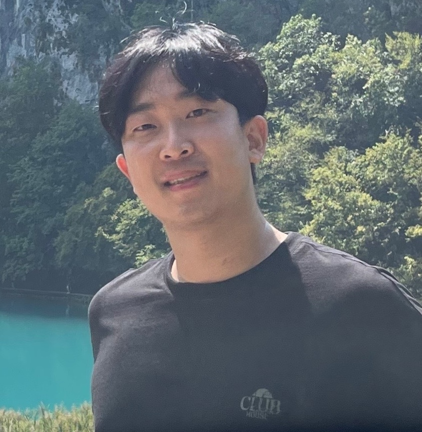

# Tutorial on Responsible Vision-Language Generative Models @ ICCV 2025
---
The official Website for Responsibly Building Generative Models Tutorial at ICCV 2025.

Date and Time : 10/19 Sunday, 1pm - 5pm

Location: 316B

Zoom link: TBD

Pwd: TBD

Hosted by [Changhoon Kim](https://www.changhoonkim.com/) (SSU), [Wanyu Du](https://wyu-du.github.io/) (AWS), Dongyoon Yang (SK Hynix), [Kyle Min](https://sites.google.com/view/kylemin) (Oracle), 
[Maitreya Patel](https://maitreyapatel.com/) (ASU) and      
[Yezhou Yang](https://yezhouyang.engineering.asu.edu/)(ASU) 

## Agenda
Over the past few years, text-to-image (T2I) and image-to-text (I2T) vision-language generative models have evolved from research prototypes to widely deployed systems, transforming fields such as entertainment, journalism, and education. While these models enable compelling applications, they also introduce critical challenges related to robustness, controllability, and ethical risks. They can generate unauthorized content, including explicit or copyright-protected material, violating ethical and legal guidelines. Additionally, they suffer from prompt misalignment, biases, factual inconsistencies, and hallucinations, raising serious reliability concerns in high-stakes applications. Despite extensive guardrails, adversarial actors continue to develop jailbreaking techniques, leading to an ongoing arms race between security measures and attacks. Addressing these vulnerabilities demands a systematic analysis of failure modes, rigorous mitigation strategies, and deeper theoretical insights into adversarial robustness. Advancing our understanding of these challenges is essential for ensuring the safe, reliable, and responsible deployment of vision-language generative models.

In this tutorial, we will provide a comprehensive exploration of vision-language generative models, covering both key challenges and recent advancements:
- Reliability concerns in the real-world deployment of state-of-art models,
- Failure models, including adversarial vulnerabilities and prompt misalignment, along with their broader implications,
- Robustness and security strategies, with theoretical insights into adversarial training and multi-modal reliability,
- Techniques for improving controllability, efficiency, and trustworthiness in vision-language generation.

Each segment of the tutorial comprises two key components: (1) an in-depth lecture covering foundational methodologies, significant research findings, and relevant literature, and (2) interactive hands-on sessions, where applicable. The hands-on sessions will allow participants to directly experiment with vision-language generative models, providing practical insights into the reliability challenges discussed in the lectures. By analyzing failure modes firsthand, attendees will gain a deeper
understanding of both theoretical frameworks and real-world implications.

## Tentative Schedule
<table>
	<tr>
		<th width="15%"> Time (UTC-10) </th>
		<th width="40%"> Topic </th>
		<th> Presenter </th>
	</tr>
	<tr>
    	<td> 10 min </td>
    	<td> Welcome Message and Tutorial Overview </td>
			<td valign="center"> 
			<!-- Speaker 1 Image and Link -->
			<a href="https://www.changhoonkim.com/">Changhoon Kim</a> (Assistant Professor, Soongsil University)
			</td>
	</tr>
	<tr>
		<td> 15 min </td>
		<td> Reliability Challenges and Advances in Vision-Language Generative Models  </td>
		<td valign="center"> 
			
			<a href="https://www.changhoonkim.com/">Changhoon Kim</a>   (Assistant Professor, Soongsil University)
		</td>
	</tr>
	<tr>
		<td> 50+5 min </td>
		<td> Enhancing Generative Model Safety through Machine Unlearning  </td>
		<td valign="center"> 
			   
			<a href="https://lsjxjtu.github.io/">Sijia Liu</a>   (Michigan State University)
		</td>
	</tr>
	<tr>
		<td> 50+5 min </td>
		<td> Adversarial Attacks and Robustness in Foundation Models  </td>
		<td valign="center"> 
			   
			<a href="https://wyu-du.github.io/">Wanyu Du</a>   (Applied Scientist, AWS)
		</td>
	</tr>
	<tr>
		<td> 50+5 min </td>
		<td>  Theoretical Foundations of Robustness in Vision-Language Generative Models  </td>
		<td valign="center"> 
			    
			<a>Dongyoon Yang</a>   (Research Scientist, SK Hynix)
		</td>
	</tr>
	<tr>
		<td> 10 min </td>
		<td> Concluding Remarks and Future Direction </td>
		<td valign="center"> 
			   
			<a href="https://faculty.engineering.asu.edu/yezhouyang/">Yezhou Yang</a>   (Associate Professor, ASU)
		</td>
	</tr>
</table>

---

## Student Co-organizers 

Minjun So (SSU)

---
*This website will be updated closer to the event date.*

